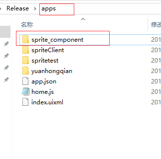

# 官方封装组件使用说明
----------

官方组件基于sprite平台提供的基础组件进行封装，首先获取封装组件 sprite_component 把该组件目录放入自己应用某个目录下面，另外还需要在应用程序的入口home.js里面进行路径配置，配置信息如下，示例中配置是直接把sprite_component放在apps更目录下，开发者根据实际目录修改路径配置信息。



>配置信息如下：  

```javascript
require.config({
jsPaths:{
},
componentPaths:{
//官方封装组件引用
"componentUI":"res:sprite_component/tmpl/component.component",
"buttonUI":"res:sprite_component/button/button.component",
"titlebarUI":"res:sprite_component/titlebar/titlebar.component",
"menubarUI":"res:sprite_component/menubar/menubar.component",
"gridmenuUI":"res:sprite_component/gridmenu/gridmenu.component",
"newsliderUI":"res:sprite_component/newslider/newslider.component",
"checkboxUI":"res:sprite_component/checkbox/checkbox.component",
"radioUI":"res:sprite_component/radio/radio.component",
"switchUI":"res:sprite_component/switch/switch.component",
"selectUI":"res:sprite_component/select/select.component",
"tabbarUI":"res:sprite_component/tabbar/tabbar.component",
"indexbarUI":"res:sprite_component/indexbar/indexbar.component",
"popmenuUI":"res:sprite_component/popmenu/popmenu.component",
"popbottommenuUI":"res:sprite_component/popbottommenu/popbottommenu.component",
"sliderbarUI":"res:sprite_component/sliderbar/sliderbar.component",
"audioplayUI":"res:sprite_component/audioplay/audioplay.component",
"superhandsignUI":"res:sprite_component/superhandsign/superhandsign.component",
"organizationUI":"res:sprite_component/organization/organization.component",
"memoryfieldUI":"res:sprite_component/memoryfield/memoryfield.component",
"audiorecordUI":"res:sprite_component/audiorecord/audiorecord.component"
},
cssPaths:{ 

}
});
```

需要注意的是，这个配置必须写在home.js的最开始位置，因为android客户端需要在最开始的时候初始化这些配置。  

在页面使用具体组件时，只需要在js里面引入对应的组件标识即可，比如引入 require("buttonUI"); ，或者直接引入require("componentUI");这个包含了所有封装的组件，如果引入所有封装组件可能会影响页面打开的速度，建议用到什么组件就导入什么组件。  
  
注1：文档中所有事件描述中没有说明参数的，都带有默认参数e。  

注2：popmenu和popbottommenu组件不支持横竖屏切换。  

注3：考虑组件模板的封装性和独立性，在开发组件模板的时候组件内部所有资源都是基于组件文件自身的相对路径，与外界没有关系，通过组件属性和接口暴露出来的方法，如果需要传入图片路径，组件模板内部会处理成uixml页面的相对路径，开发者可以直接基于自己的uixml页面写相对路径往里面传。  

不过如果有开发者自己开发模板，在模板里面又套用了组件模板，开发者需要在自己的模板里面通过this.getPathLocation()方法得到自己当前模板的绝对位置，然后拼接完整路径传给调用的模板。比如开发者自己开发了一个组件模板xxx.component, 在里面用到了button组件，如果给button组件设置licon属性的时候，开发者需要拼接一个机遇自己模板的完整图片路径。如果开发者不作处理在官方封装的组件里面都会处理成uixml页面的相对地址（有些控件的特殊处理会在下面的文档里面说明，比如titlebar组件）。


组件源码查看地址：[https://github.com/yuanhongqian/SpriteUI](https://github.com/yuanhongqian/SpriteUI)  

实例中用的样式文件： [https://github.com/yuanhongqian/SpriteUI/blob/master/src/css.zip](https://github.com/yuanhongqian/SpriteUI/blob/master/src/css.zip)